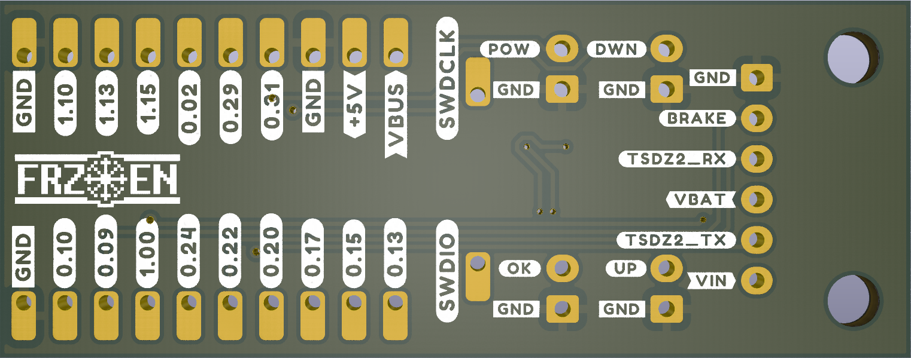
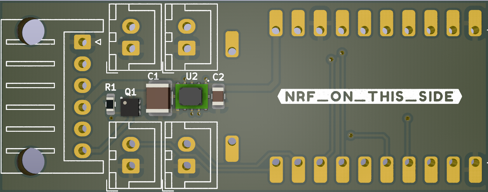

# TSDZ2 NRF module board

Simple, low component count, inspired by @stsdc

# BOM
| Component | Size | Value |
| --- | --- | --- |
| R1     | 0603 | DNP |
| C1     | 1210 | 2.2uF |
| C2     | 0805 | 22uF |
| Q1     | UDFN6B | SSM6K361NU |
| U1     | NRF Dongle | NRF Dongle |
| U2     | TPSM265R1 | TPSM265R1 |